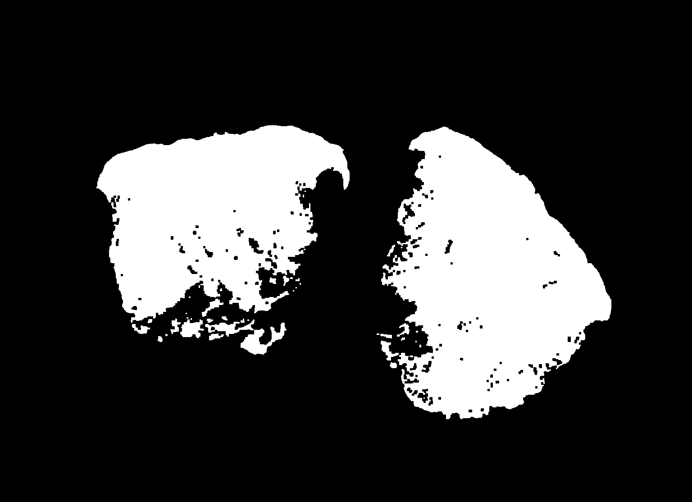
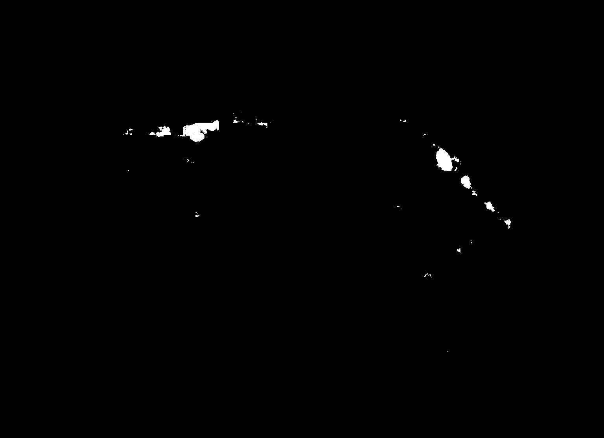
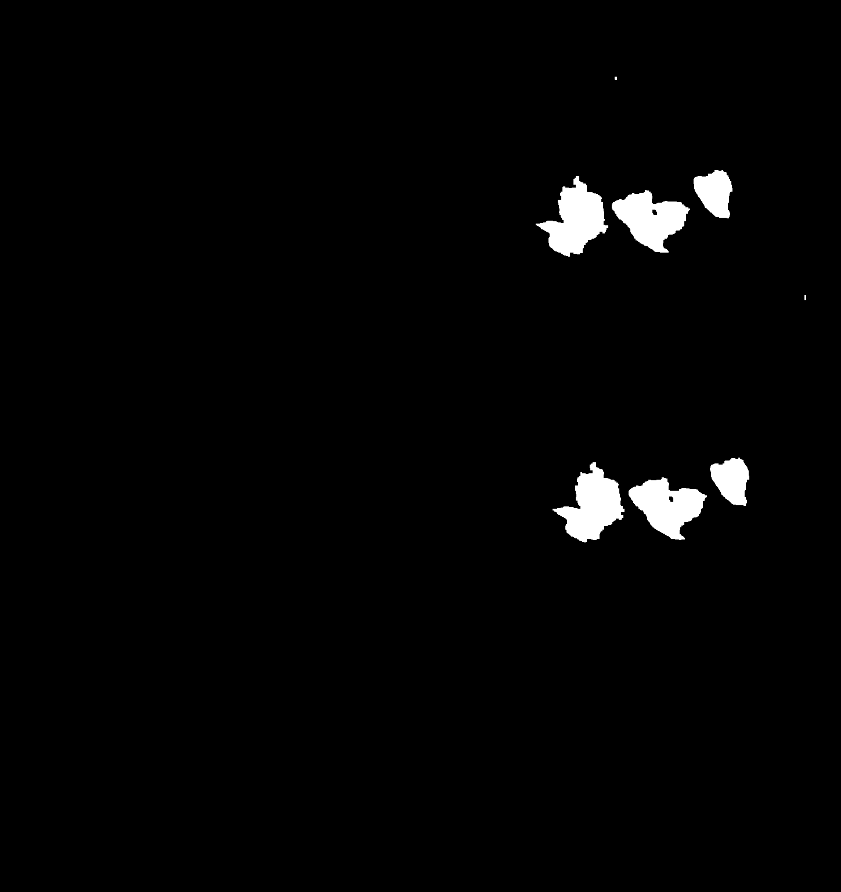
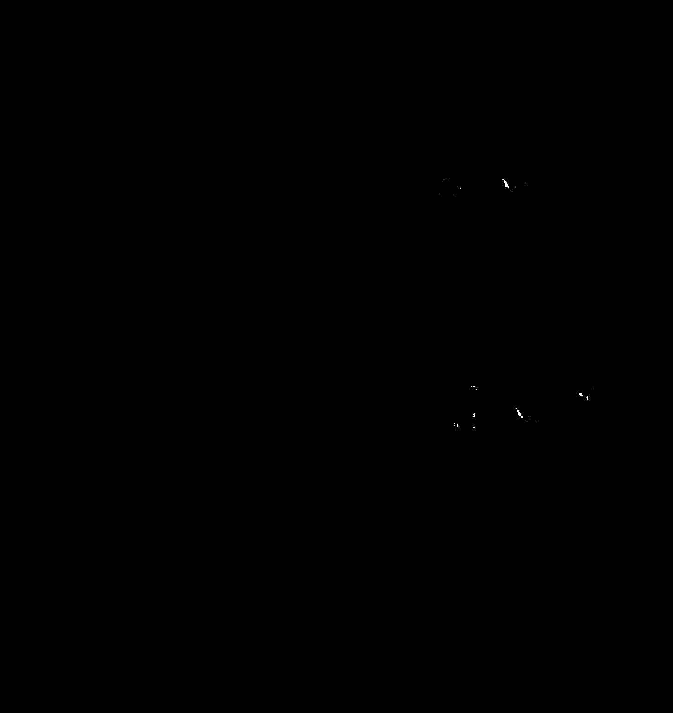
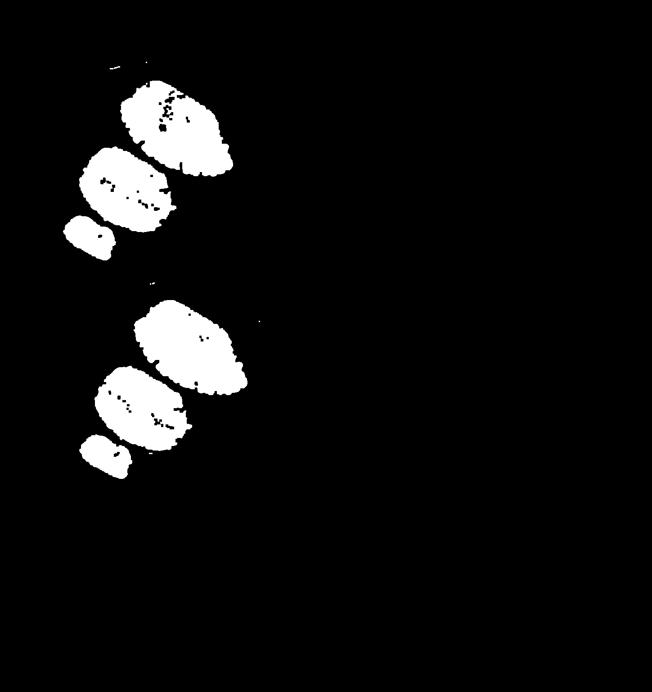
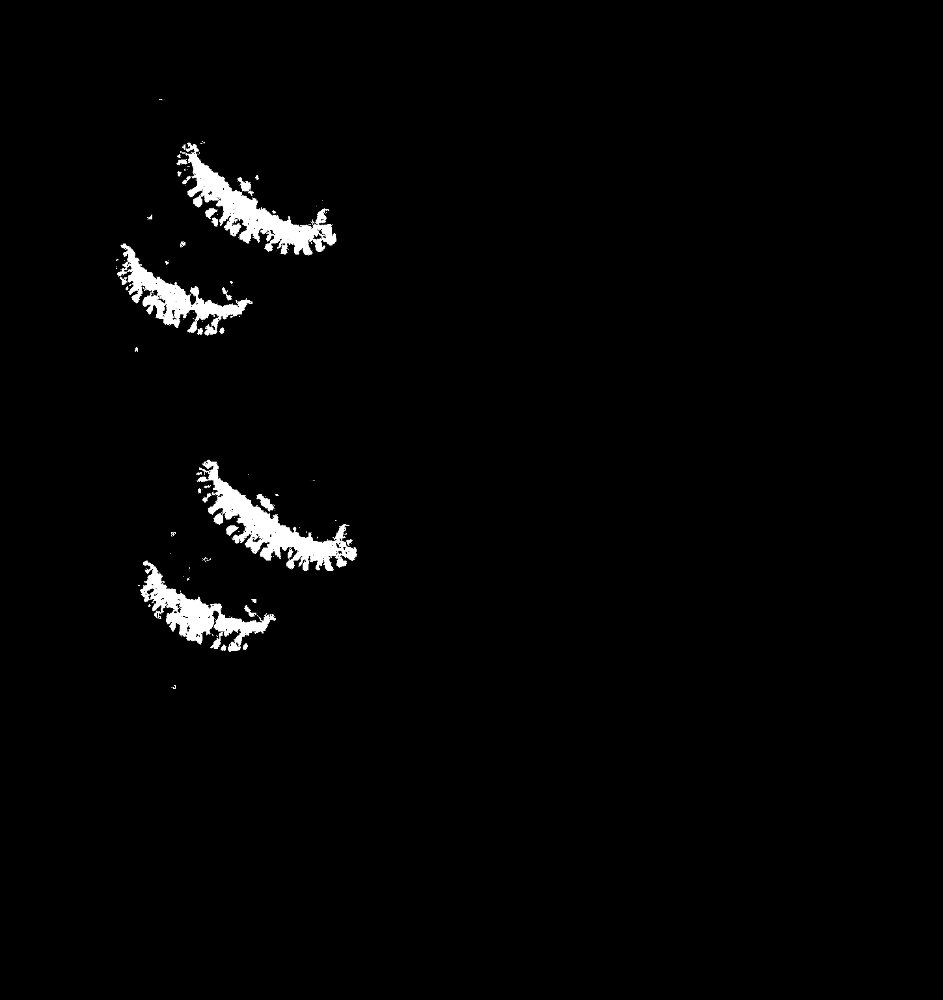
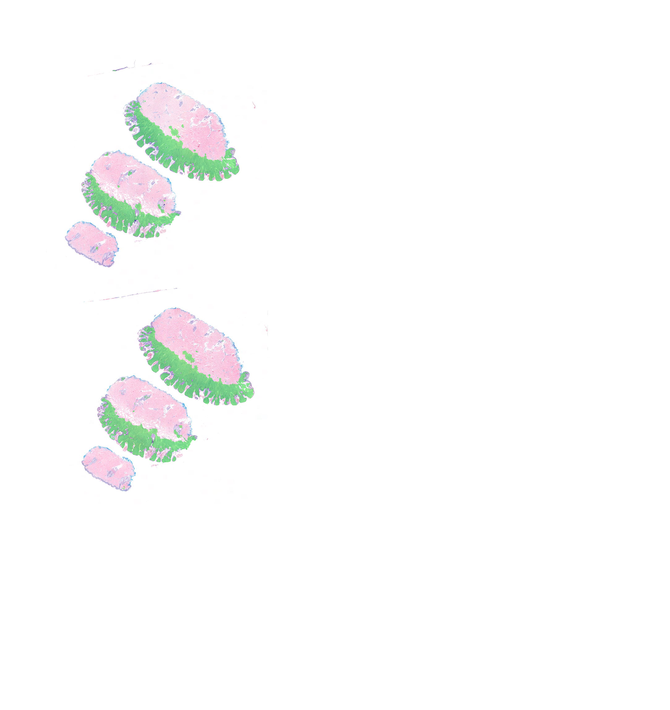
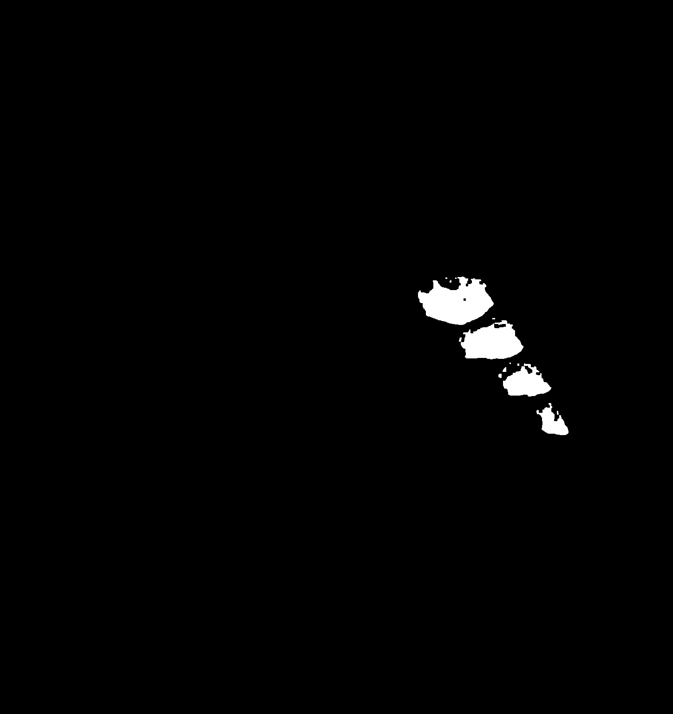
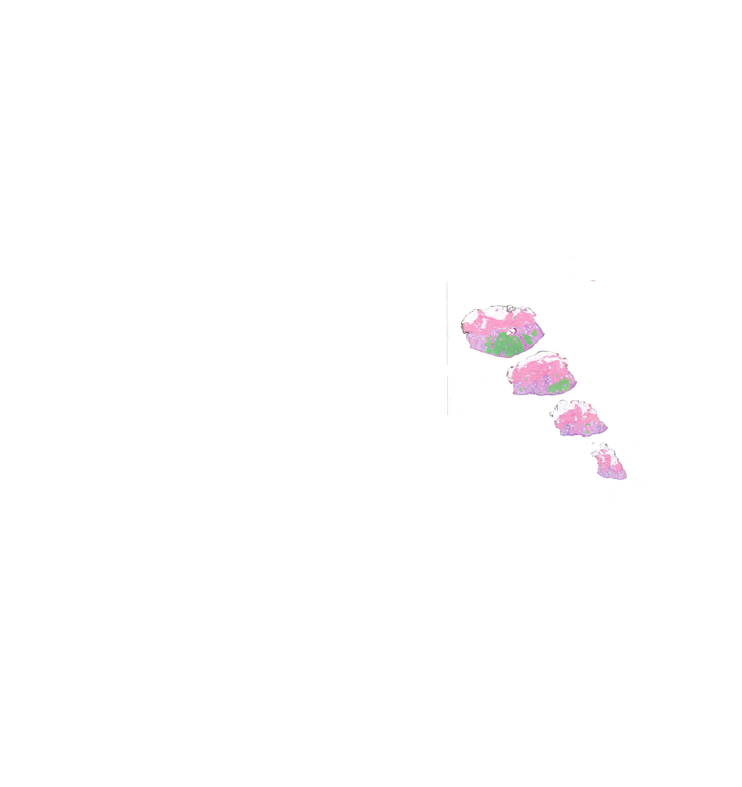

# Results

The images below show the latest segmentation results for four slides.

## Available result files

```text
docs/
└── results/
    ├── KLMP45690052_001_tissue.png
    ├── KLMP45690052_001_mask.png
    ├── KLMP45690052_001_overlay.png
    ├── MJUL22785295_001_tissue.png
    ├── MJUL22785295_001_mask.png
    ├── MJUL22785295_001_overlay.png
    ├── MKQD63856403_001_tissue.png
    ├── MKQD63856403_001_mask.png
    ├── MKQD63856403_001_overlay.png
    ├── QOFN21275156_001_tissue.png
    ├── QOFN21275156_001_mask.png
    └── QOFN21275156_001_overlay.png
```

## Results table

| Slide ID | Tissue mask | Binary mask | Overlay |
|---|---|---|---|
| KLMP45690052_001 |  |  |  |
| MJUL22785295_001 |  |  |  |
| MKQD63856403_001 |  |  |  |
| QOFN21275156_001 |  |  |  |

## What the artifacts mean

- **Tissue mask**: a thumbnail-derived heuristic used only for scheduling
- **Binary mask**: the final thresholded model prediction
- **Overlay**: the slide thumbnail with the binary mask overlaid